# 🛡️ Awesome Password Management 🔑

  
  
  
  

## 🚀 Top Password Management Platforms Ecosystem 🔐

**Curated List of SaaS Password Managers, Self-Hosted Vaults & Open-Source GitHub Projects**

*Focused on Password Vaults, Credential Sharing, Autofill, Passkeys, Zero-Knowledge Encryption & Secrets Management*

**Last updated: September 2026** 📅

---

### 💡 Overview & SEO Guide

This repository tracks notable commercial **SaaS password management platforms** and **open-source security projects**. These tools securely store, generate, autofill, and share passwords, passkeys, and API secrets for individuals, families, and enterprise teams. They feature zero-knowledge end-to-end encryption, multi-factor authentication (MFA), and cross-platform sync across desktop, mobile, and web browsers.

---

## 📑 Table of Contents

- [☁️ SaaS / Hosted Password Management Platforms](#-saashosted-password-management-platforms)
- [🔓 Open-Source GitHub Projects](#-open-source-github-projects)
- [🤝 How to Contribute](#-how-to-contribute)
- [⭐ Star History](#-star-history)
- [⚠️ Disclaimer](#%EF%B8%8F-disclaimer)

---

## ☁️ SaaS / Hosted Password Management Platforms

> 📊 **Market Size & Industry Dynamics:**  
> The global password management market is estimated at **$3.0 Billion - $4.5 Billion (2026)** and is projected to reach **$15+ Billion by 2032** growing at a CAGR of ~18-20%.  
> **Market Fragmentation:** The industry is **moderately fragmented**. While major commercial leaders (1Password, Bitwarden, Keeper, Dashlane, NordPass) capture significant market share in personal and enterprise segments, strong open-source self-hosted alternatives prevent a winner-take-all monopoly.

### 💰 SaaS Products Comparison Table

*Sorted by Company Size / Valuation / ARR (Descending)* 📉

| Product | Description | Starting Price 💵 | Free Tier Limits 🎁 | Company Size / Valuation / Revenue 🏢 |
| :--- | :--- | :--- | :--- | :--- |
| **[Zoho Vault](https://www.zoho.com/vault/)** | 🔐 Password manager integrated with the Zoho ecosystem for enterprise teams. | $1.00/user/month (Standard plan, billed annually) | Free forever for 1 user (unlimited passwords & notes for personal use) | **$12.5B Valuation** (Zoho Corp, ~$1B+ Revenue) |
| **[1Password](https://1password.com/)** | 🔑 Premium password manager known for polished UX, Secret Key security model, & Travel Mode. | $2.99/month (Individual plan, billed annually) | 14-day free trial (full features; no permanent free plan) | **$6.8B Valuation** ($400M+ ARR) |
| **[NordPass](https://nordpass.com/)** | 🛡️ Modern password manager emphasizing biometric unlock, passkeys, and smooth sync. | $1.49/month (Personal Premium 2-year commitment) | Free forever for 1 user (unlimited passwords; 1 active logged-in device) | **$3.0B Valuation** (Parent Nord Security) |
| **[Keeper](https://www.keepersecurity.com/)** | 🏰 Enterprise-grade password & secrets manager with zero-knowledge encryption & compliance. | $3.58/month ($42.99/year Unlimited plan) | 30-day free trial; free tier limited to 1 mobile device & 10 records | **$225M ARR** (Private Equity backed) |
| **[Dashlane](https://www.dashlane.com/)** | ⚡ Feature-rich password manager with built-in VPN, dark-web monitoring, and real-time security. | $4.99/month (Premium plan, billed annually) | Free forever for 1 user (limited to 25 passwords; read-only if exceeded) | **$113M ARR** (~$192M total VC funding raised) |
| **[LastPass](https://www.lastpass.com/)** | 🌐 Cloud password manager offering personal and business plans with automated autofill. | $3.00/month (Premium plan, billed annually) | Free forever for 1 user (restricted to 1 device type: computer or mobile) | **~$100M ARR** (Acquired by GoTo / LogMeIn) |
| **[Passbolt](https://www.passbolt.com/)** | 👥 Team-first, open-source hosted password manager built for DevOps collaboration & audit trails. | €4.90/user/month (Cloud Business plan) | 7-day free trial for Cloud (Self-hosted Community Edition is free forever) | **~$5M ARR** (~$12.5M total funding) |
| **[Bitwarden](https://bitwarden.com/)** | 🌟 Top open-source password manager with transparent zero-knowledge cloud hosting. | $1.65/month ($19.80/year Premium plan) | Free forever for 1 user (unlimited items & devices; 2-person sharing) | **~$10M-$20M ARR** ($100M Series B funding) |
| **[Enpass](https://www.enpass.io/)** | 📦 Offline-first password manager storing encrypted vaults locally or on personal cloud storage. | $1.99/month (Individual Premium plan) | Free desktop & mobile version limited to 25 items and 1 vault | **Private Bootstrapped** (~$2M-$5M ARR est.) |
| **[RoboForm](https://www.roboform.com/)** | 📝 Classic password manager & form filler with robust browser integration. | $0.99/month ($11.90/year Premium plan) | Free forever for 1 device (unlimited passwords on single device) | **Private Bootstrapped** (~$1M-$3M ARR est.) |

---

## 🔓 Open-Source GitHub Projects

*Sorted by GitHub Star Count (Descending)* ⭐

- **[Vaultwarden](https://github.com/dani-garcia/vaultwarden)**   
  ⚡ *Lightweight Rust implementation of the Bitwarden server API — perfect for self-hosting with minimal resources.*

- **[KeePassXC](https://github.com/keepassxreboot/keepassxc)**   
  💻 *Modern, cross-platform offline password manager using encrypted local KDBX databases with browser integration.*

- **[Bitwarden Server](https://github.com/bitwarden/server)**   
  🏢 *Official C# backend server code for the Bitwarden open-source password management platform.*

- **[gopass](https://github.com/gopasspw/gopass)**   
  🛠️ *The ultimate CLI password manager for Unix hackers, supporting GPG encryption and Git synchronization.*

- **[Passbolt API / Server](https://github.com/passbolt/passbolt_api)**   
  🤝 *Open-source, team-oriented password manager backend built with OpenPGP encryption and audit capabilities.*

- **[Buttercup](https://github.com/buttercup/buttercup-desktop)**   
  🧈 *Cross-platform NodeJS & Electron password manager with strong AES-256 encryption.*

- **[Padloc](https://github.com/padloc/padloc)**   
  📱 *Clean, modern open-source password manager for individuals and teams with cross-platform support.*

- **[Proton Pass Android](https://github.com/protonpass/android-pass)**   
  ⚛️ *Official open-source Android client for Proton Pass by the privacy-focused Proton team.*

- **[Psono Server](https://github.com/psono/psono-server)**   
  🔒 *Enterprise password manager focused on client-side encryption and team credential distribution.*

- **[pass (password-store)](https://www.passwordstore.org/)**  
  🐧 *Standard Unix password manager storing credentials in GPG-encrypted files managed inside a Git repository.*

- **[KeePassDX / KeePass Ecosystem](https://keepass.info/)**  
  📱 *Classic open-source password database ecosystem and modern Android/iOS ports.*

---

### 💡 Recommendation Guidelines for Password Managers

- 🏆 **Best Overall Usability & Openness**: **Bitwarden** (Cloud or self-hosted via **Vaultwarden**).
- 🔒 **Best Fully Offline Local Control**: **KeePassXC** (No cloud required, encrypted `.kdbx` vault file).
- 🏢 **Best for Enterprise Team Sharing & Audit**: **Passbolt** or **1Password**.
- 👩‍💻 **Best for Terminal / Developers**: **gopass** or **pass (password-store)**.

---

## 🤝 How to Contribute

1. 🍴 Fork the repository.
2. ✏️ Add or update entries in `README.md` (follow existing format & tables).
3. 📝 Include: Name, website link, clear description, pricing details, and open-source star count.
4. 🚀 Submit a Pull Request (PR) with a short summary.

Also check out [Awesome-Awesome-Awesome](https://github.com/ishandutta2007/Awesome-Awesome-Awesome) for more curated awesome lists!

---

## 📈 Star History

---

## ⚠️ Disclaimer

- This list is **community-curated** for educational purposes and is not formal security advice or endorsement.
- Password managers hold critical credentials. Always enforce **strong master passwords**, enable **multi-factor authentication (2FA/TOTP)**, and keep software updated.

---

  <b>Made with ❤️ for individuals, families, and security teams worldwide.</b>

